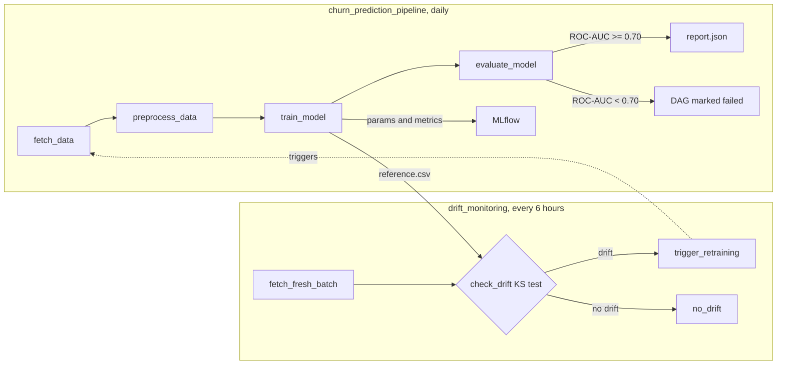

# Airflow ML Pipeline


An end-to-end machine learning pipeline orchestrated with Apache Airflow. Runs on a daily schedule and covers data fetching, preprocessing, model training, and quality-gated evaluation. Experiment tracking via MLflow.

## Pipeline Steps

```
fetch_data -> preprocess_data -> train_model -> evaluate_model
```

Each step is a separate Airflow task. If the model fails the quality gate (ROC-AUC < 0.70), the DAG is marked as failed.

## Architecture

Two DAGs work together: a daily training pipeline and a drift monitor that
triggers retraining when incoming data no longer matches the training data.



## Drift Detection

The training step snapshots its raw features as `reference.csv`. The
drift monitor compares each new data batch against that snapshot with a
Kolmogorov-Smirnov test per feature. When at least half the features
drift (p < 0.05), the monitor triggers the training DAG.

## Tech Stack

| Layer | Technology |
|---|---|
| Language | Python 3.11 |
| Orchestration | Apache Airflow 2.9 |
| Model | GradientBoosting (scikit-learn) |
| Experiment Tracking | MLflow |
| Database | PostgreSQL (Airflow metadata) |
| Containerization | Docker Compose |
| CI/CD | GitHub Actions |
| Testing | Pytest |

## Quick Start

**Install dependencies (for running tests locally)**

```bash
pip install -r requirements.txt
pytest tests/ -v
```

**Install Airflow (for running the full DAG locally)**

```bash
pip install apache-airflow==2.9.2
```

**Run the full stack with Docker Compose**

```bash
docker-compose up --build
```

| Service | URL |
|---|---|
| Airflow UI | http://localhost:8080 |
| MLflow UI | http://localhost:5000 |

Default Airflow credentials: `airflow / airflow`

The `churn_prediction_pipeline` DAG will appear in the UI. Trigger it manually or wait for the daily schedule.

## DAG Structure

```python
t1 = fetch_data        # generate raw customer data
t2 = preprocess_data   # scale features with StandardScaler
t3 = train_model       # train GradientBoosting, log to MLflow
t4 = evaluate_model    # check ROC-AUC >= 0.70, write report.json

t1 >> t2 >> t3 >> t4
```

## Running Tests

Pipeline steps are tested independently without Airflow.

```bash
pytest tests/ -v
```

## CI/CD

Every push to `main` runs the full pipeline test suite via GitHub Actions.
